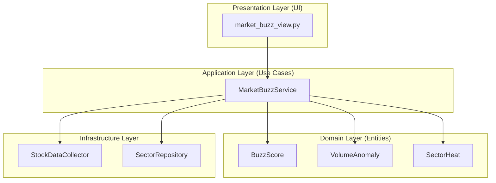

# Phase 21: Market Heat & Buzz 기능 개발

> **목표**: 불안정한 Google Trends 기반 '소셜 트렌드' 탭을 **거래량 이상 감지(Plan A)** + **섹터 히트맵(Plan C)**으로 대체

---

## 📋 기능 개요

### 기존 vs 신규 비교

| 항목 | 기존 (Social Trend) | 신규 (Market Buzz) |
|------|---------------------|-------------------|
| 데이터 소스 | Google Trends API | yfinance (거래량, 가격) |
| 안정성 | ❌ 자주 실패 | ✅ 100% 신뢰 가능 |
| 측정 대상 | 검색량 (간접적) | 거래량/변동성 (직접적) |
| 분석 단위 | 개별 종목 | 개별 종목 + 섹터 전체 |

### 핵심 기능

1. **🔥 Volume Anomaly Detector**: 평소 대비 거래량 급증 종목 감지
2. **📊 Sector Heatmap**: 업종별 등락률 히트맵 시각화
3. **⚡ Buzz Score**: 관심도 점수 (0~100) 계산

---

## 🏗️ Clean Architecture 설계



---

## 📁 파일 구조

```
src/
├── domain/
│   └── market_buzz/
│       ├── __init__.py
│       ├── entities/
│       │   ├── __init__.py
│       │   ├── buzz_score.py        ← [NEW] BuzzScore 엔티티
│       │   ├── volume_anomaly.py    ← [NEW] VolumeAnomaly 엔티티
│       │   └── sector_heat.py       ← [NEW] SectorHeat 엔티티
│       └── value_objects/
│           └── heat_level.py        ← [NEW] HeatLevel VO (HOT/WARM/COLD)
│
├── infrastructure/
│   └── repositories/
│       └── sector_repository.py     ← [NEW] 섹터-종목 매핑 저장소
│
├── services/
│   └── market_buzz_service.py       ← [NEW] 핵심 비즈니스 로직
│
└── dashboard/
    └── views/
        └── market_buzz_view.py      ← [NEW] Streamlit UI
```

---

## 📦 Proposed Changes

### Domain Layer

#### [NEW] `buzz_score.py`
```python
@dataclass
class BuzzScore:
    """종목별 관심도 점수"""
    ticker: str
    name: str
    score: float  # 0~100
    volume_ratio: float  # 평소 대비 거래량 비율
    volatility_ratio: float  # 평소 대비 변동성 비율
    heat_level: str  # "HOT" | "WARM" | "COLD"
    last_updated: datetime
```

#### [NEW] `volume_anomaly.py`
```python
@dataclass
class VolumeAnomaly:
    """거래량 이상 감지 결과"""
    ticker: str
    name: str
    current_volume: int
    avg_volume: int
    volume_ratio: float
    is_spike: bool  # ratio > 2.0
    detected_at: datetime
```

#### [NEW] `sector_heat.py`
```python
@dataclass
class SectorHeat:
    """섹터별 온도"""
    sector_name: str
    avg_change_pct: float
    top_gainers: List[str]
    top_losers: List[str]
    heat_level: str
    stock_count: int
```

---

### Infrastructure Layer

#### [NEW] `sector_repository.py` (외부 API 연동 방식)

```python
class SectorRepository:
    """섹터-종목 매핑 관리 (외부 API 기반)"""
    
    def __init__(self):
        self._cache = {}  # {market: {sector: [tickers]}}
        self._cache_ttl = 86400  # 24시간
        self._last_update = {}
    
    # === 미국 시장: Yahoo Finance Screener ===
    def fetch_us_sectors(self) -> Dict[str, List[str]]:
        """
        Yahoo Finance Screener API로 S&P 500 섹터별 종목 조회
        
        GICS Sector 분류:
        - Information Technology
        - Health Care
        - Financials
        - Consumer Discretionary
        - Communication Services
        - Industrials
        - Consumer Staples
        - Energy
        - Utilities
        - Real Estate
        - Materials
        """
        # yfinance Ticker.info['sector'] 활용
        # S&P 500 구성 종목 리스트를 먼저 가져온 후
        # 각 종목의 sector 정보로 그룹화
    
    # === 한국 시장: KRX API ===
    def fetch_kr_sectors(self) -> Dict[str, List[str]]:
        """
        KRX OpenAPI로 KOSPI/KOSDAQ 업종별 종목 조회
        
        주요 업종:
        - 반도체
        - 2차전지/배터리
        - 바이오/제약
        - 자동차
        - 화학
        - 철강/금속
        - 건설
        - 은행/증권
        - IT/소프트웨어
        - 조선
        
        API: http://data.krx.co.kr
        """
        # KRX 공개 API 사용 (인증키 불필요)
        # 또는 FinanceDataReader 라이브러리 활용
    
    def get_sectors(self, market: str, force_refresh: bool = False) -> Dict[str, List[str]]:
        """캐시된 섹터 데이터 반환 (필요 시 갱신)"""
        if force_refresh or self._should_refresh(market):
            if market == "US":
                self._cache[market] = self.fetch_us_sectors()
            elif market == "KR":
                self._cache[market] = self.fetch_kr_sectors()
            self._last_update[market] = datetime.now()
        
        return self._cache.get(market, {})
    
    def get_stocks_by_sector(self, market: str, sector: str) -> List[str]:
        """특정 섹터의 종목 리스트 반환"""
        sectors = self.get_sectors(market)
        return sectors.get(sector, [])
    
    def _should_refresh(self, market: str) -> bool:
        """캐시 갱신 필요 여부 판단"""
        if market not in self._last_update:
            return True
        elapsed = (datetime.now() - self._last_update[market]).total_seconds()
        return elapsed > self._cache_ttl
```

**의존성 추가:**
```bash
pip install financedatareader  # KRX 데이터 (선택)
# yfinance는 이미 설치되어 있음
```

---

### Application Layer

#### [NEW] `market_buzz_service.py`
```python
class MarketBuzzService:
    """시장 관심도 분석 서비스"""
    
    def __init__(self, sector_repo: SectorRepository):
        self.sector_repo = sector_repo
        self.collector = StockDataCollector()
    
    def calculate_buzz_score(self, ticker: str) -> BuzzScore:
        """개별 종목 관심도 점수 계산"""
        # 1. 20일 평균 거래량 대비 현재 거래량 비율
        # 2. 20일 평균 변동성 대비 현재 변동성 비율
        # 3. 두 비율을 결합하여 0~100 점수화
    
    def detect_volume_anomalies(
        self, 
        tickers: List[str],
        threshold: float = 2.0
    ) -> List[VolumeAnomaly]:
        """거래량 급증 종목 감지"""
    
    def get_sector_heatmap(self, market: str = "KR") -> List[SectorHeat]:
        """섹터별 온도 히트맵 데이터"""
    
    def get_top_buzz_stocks(self, market: str, top_n: int = 10) -> List[BuzzScore]:
        """관심도 상위 종목 리스트"""
```

---

### Presentation Layer

#### [NEW] `market_buzz_view.py`
```python
def render_market_buzz_tab():
    """Market Heat & Buzz 탭 렌더링"""
    
    st.subheader("🔥 Market Heat & Buzz")
    
    # 1. 섹터 히트맵 (Plotly Treemap)
    _render_sector_heatmap()
    
    # 2. 거래량 급증 알림
    _render_volume_anomalies()
    
    # 3. 관심도 Top 10
    _render_top_buzz_stocks()
```

---

## 🎨 UI 디자인 (예상)

### 섹터 히트맵
- **Plotly Treemap** 사용
- 색상: 상승(초록) ~ 하락(빨강) 그라데이션
- 크기: 시가총액 또는 거래대금 비례

### 거래량 급증 알림
- **카드 형태**로 상위 5개 종목 표시
- "🚀 삼성전자: 평소 대비 **320%** 거래량 폭발!"

### 관심도 Top 10
- **Progress Bar** 형태로 Buzz Score 시각화
- 점수별 색상 (🔴 HOT > 🟠 WARM > 🔵 COLD)

---

## 🔄 기존 코드 처리

| 파일 | 처리 방식 |
|------|----------|
| [social_trend_service.py](file:///D:/Stock/src/services/social_trend_service.py) | **DEPRECATE** (삭제하지 않고 유지, import만 제거) |
| [social_analyzer.py](file:///D:/Stock/src/analyzers/social_analyzer.py) | **DEPRECATE** |
| [app.py](file:///D:/Stock/src/dashboard/app.py) 소셜 트렌드 탭 | **REPLACE** with `market_buzz_view.py` 호출 |

---

## ✅ Verification Plan

### 1. Unit Tests
```bash
# 테스트 파일: tests/unit/test_market_buzz_service.py
pytest tests/unit/test_market_buzz_service.py -v
```

**테스트 케이스:**
- `test_buzz_score_calculation`: 점수가 0~100 범위인지 확인
- `test_volume_anomaly_detection`: threshold 초과 시 is_spike=True
- `test_sector_heatmap_structure`: 반환 데이터 구조 검증

### 2. Integration Tests
```bash
# 테스트 파일: tests/integration/test_market_buzz_e2e.py
pytest tests/integration/test_market_buzz_e2e.py -v
```

**테스트 케이스:**
- 실제 yfinance 데이터로 서비스 호출
- 섹터별 데이터 집계 검증

### 3. Manual Browser Test
1. `streamlit run src/dashboard/app.py` 실행
2. 📈 소셜 트렌드(또는 리네이밍된 탭) 클릭
3. **확인 사항:**
   - 섹터 히트맵이 정상 렌더링되는가?
   - 거래량 급증 종목이 표시되는가?
   - 에러 없이 전체 페이지가 로드되는가?

---

## 📅 구현 순서

1. **Phase 21.1**: Domain Layer (Entities, VOs)
2. **Phase 21.2**: Infrastructure Layer (SectorRepository)
3. **Phase 21.3**: Application Layer (MarketBuzzService)
4. **Phase 21.4**: Presentation Layer (market_buzz_view.py)
5. **Phase 21.5**: app.py 통합 및 기존 탭 교체
6. **Phase 21.6**: 테스트 작성 및 검증

---

## ⚠️ Implementation Notes

> [!IMPORTANT]
> **외부 API 연동 방식 채택**
> 
> **미국 시장:**
> - **데이터 소스**: Yahoo Finance (yfinance library)
> - **방법**: S&P 500 구성 종목을 순회하며 `Ticker.info['sector']` 정보로 그룹화
> - **장점**: 실시간 업데이트, 정확한 GICS 섹터 분류
> - **단점**: API 호출 횟수 많음 (500개 종목) → 캐싱 필수
> 
> **한국 시장:**
> - **데이터 소스**: KRX OpenAPI 또는 FinanceDataReader
> - **방법**: KOSPI/KOSDAQ 업종별 종목 리스트 직접 조회
> - **장점**: 공식 데이터, 무료, 인증키 불필요
> - **단점**: 응답 속도가 느릴 수 있음 → 24시간 캐싱
> 
> **캐싱 전략:**
> - TTL: 24시간 (섹터 구성은 자주 바뀌지 않음)
> - 첫 로드 시간: ~30초 (미국 시장 500개 종목 조회)
> - 이후 로드: 즉시 (캐시 사용)

> [!WARNING]
> **Rate Limiting 주의**
> Yahoo Finance는 짧은 시간에 많은 요청 시 일시적으로 차단될 수 있습니다.
> 배치 요청 시 `time.sleep(0.1)` 등으로 딜레이를 추가하세요.

---
---

# 📋 기획서 검토 및 개선 권장사항

> **검토일**: 2025-12-25
> **검토 기준**: Feature Planner Skill + Clean Architecture + Phase 20 통합
> **검토자**: Claude Code (Sonnet 4.5)

---

## ✅ 강점 분석

### 1. Clean Architecture 준수 ⭐⭐⭐⭐⭐

**평가**:
- ✅ Domain/Application/Infrastructure/Presentation 명확히 분리
- ✅ Repository Pattern 적용 (SectorRepository)
- ✅ Entity/VO 구분 명확 (BuzzScore, VolumeAnomaly, HeatLevel)
- ✅ Service Layer 의존성 주입 설계

**기대 효과**:
- 테스트 가능성 향상 (Mock Repository 주입 가능)
- 데이터 소스 교체 용이 (yfinance → 다른 API)

---

### 2. 기술적 실현 가능성 ⭐⭐⭐⭐⭐

**평가**:
- ✅ 기존 yfinance 인프라 활용 (추가 API 키 불필요)
- ✅ Google Trends 의존성 제거로 안정성 향상
- ✅ 24시간 캐싱 전략 합리적

---

### 3. UI/UX 설계 ⭐⭐⭐⭐

**평가**:
- ✅ Plotly Treemap (섹터 히트맵) - 직관적
- ✅ 카드 형태 알림 - 사용자 친화적
- ✅ Progress Bar 시각화 - 명확한 정보 전달

---

## 🔴 중대한 누락 사항

### 1. Phase 20 투자 성향 연동 미정의 (우선순위: ⭐⭐⭐⭐⭐)

**문제**:
- ✅ Market Buzz 기능은 정의됨
- ❌ **Phase 20 투자 성향 프로필과의 통합 방안 없음**
- ❌ 사용자 성향에 맞는 Buzz 종목 필터링 로직 없음

**영향**:
- Phase 20에서 구축한 투자 성향 프로필이 활용되지 않음
- 개인화 추천 시스템과 단절된 독립적 기능으로 전락
- 사용자 경험 일관성 저하

**해결 방안**:

#### Option A: ProfileAwareBuzzService (권장)

```python
# src/services/profile_aware_buzz_service.py
class ProfileAwareBuzzService:
    """
    투자 성향 기반 맞춤 Buzz 분석 서비스
    Phase 20 InvestorProfile과 연동
    """

    def __init__(
        self,
        market_buzz_service: MarketBuzzService,
        profile_repo: IProfileRepository
    ):
        self.buzz_service = market_buzz_service
        self.profile_repo = profile_repo

    def get_personalized_buzz_stocks(
        self,
        user_id: str,
        market: str = "KR",
        top_n: int = 10
    ) -> List[BuzzScore]:
        """
        사용자 성향에 맞는 관심 종목 필터링

        로직:
        1. MarketBuzzService에서 전체 Buzz 종목 조회
        2. 사용자 프로필 로드
        3. 프로필 기반 필터링:
           - 안정형: 변동성 높은 종목 제외
           - 공격투자형: HOT 종목만 표시
           - 선호 섹터: 해당 섹터 우선 표시
        """
        # 1. 전체 Buzz 종목 조회
        all_buzz = self.buzz_service.get_top_buzz_stocks(market, top_n=50)

        # 2. 프로필 로드
        profile = self.profile_repo.load(user_id)
        if not profile:
            # 프로필 없으면 전체 반환
            return all_buzz[:top_n]

        # 3. 성향 기반 필터링
        filtered = []
        for buzz in all_buzz:
            # 변동성 체크
            if profile.risk_tolerance.value <= 40:  # 안정형/안정추구형
                if buzz.volatility_ratio > 2.0:
                    continue  # 변동성 높은 종목 제외

            # 선호 섹터 우선순위
            sector = self._get_stock_sector(buzz.ticker)
            if sector in profile.preferred_sectors:
                buzz.score += 10  # 보너스 점수

            filtered.append(buzz)

        # 점수순 정렬 후 상위 N개
        filtered.sort(key=lambda x: x.score, reverse=True)
        return filtered[:top_n]

    def _get_stock_sector(self, ticker: str) -> str:
        """종목의 섹터 조회 (캐싱)"""
        # yfinance로 섹터 정보 조회
        pass
```

#### Option B: BuzzScore에 Profile Fit 추가

```python
# src/domain/market_buzz/entities/buzz_score.py (수정)
@dataclass
class BuzzScore:
    """종목별 관심도 점수 (프로필 적합도 포함)"""
    ticker: str
    name: str
    base_score: float  # 기본 Buzz 점수 (0~100)
    profile_fit_score: float  # 프로필 적합도 (0~100) ← NEW
    final_score: float  # 종합 점수 (base_score * 0.6 + profile_fit * 0.4)
    volume_ratio: float
    volatility_ratio: float
    heat_level: str
    last_updated: datetime
```

**추가 필요 작업**:
- `profile_aware_buzz_service.py` 파일 생성
- UI에 "내 성향에 맞는 Buzz" vs "전체 Buzz" 토글 추가
- Phase 21.7: Phase 20 통합 단계 추가

---

### 2. 섹터별 데이터 집계 성능 이슈 (우선순위: ⭐⭐⭐⭐⭐)

**문제**:
- ✅ 섹터별 히트맵 기능 정의됨
- ❌ **500개 종목(미국) / 2000개 종목(한국) 실시간 조회 시 성능 병목**
- ❌ 첫 로드 시간 30초+ 예상 (사용자 경험 저하)

**영향**:
- 사용자가 탭 클릭 후 30초 대기 → 이탈률 증가
- Streamlit 앱 전체가 블로킹될 수 있음

**해결 방안**:

#### Option A: 백그라운드 배치 업데이트 (강력 권장)

```python
# scripts/update_sector_data_batch.py
"""
매일 장 마감 후 섹터별 데이터 미리 계산
→ 사용자 접속 시 캐시에서 즉시 로드
"""
import schedule
import time
from src.services.market_buzz_service import MarketBuzzService
from src.infrastructure.repositories.sector_repository import SectorRepository

def update_sector_heatmap():
    """섹터 히트맵 데이터 사전 계산"""
    print(f"[{datetime.now()}] Updating sector heatmap...")

    sector_repo = SectorRepository()
    buzz_service = MarketBuzzService(sector_repo)

    # 미국 시장
    us_heatmap = buzz_service.get_sector_heatmap(market="US")
    buzz_service.cache_heatmap("US", us_heatmap)
    print(f"  ✅ US sectors updated: {len(us_heatmap)} sectors")

    # 한국 시장
    kr_heatmap = buzz_service.get_sector_heatmap(market="KR")
    buzz_service.cache_heatmap("KR", kr_heatmap)
    print(f"  ✅ KR sectors updated: {len(kr_heatmap)} sectors")

# 매일 오후 4시 (미국 장 마감), 오후 5시 (한국 장 마감) 실행
schedule.every().day.at("16:00").do(update_sector_heatmap)  # US
schedule.every().day.at("17:00").do(update_sector_heatmap)  # KR

while True:
    schedule.run_pending()
    time.sleep(60)
```

**MarketBuzzService에 캐싱 메서드 추가**:
```python
class MarketBuzzService:
    def __init__(self, sector_repo: SectorRepository):
        self.sector_repo = sector_repo
        self.collector = StockDataCollector()
        self._heatmap_cache = {}  # {market: (data, timestamp)}
        self._cache_ttl = 3600  # 1시간

    def cache_heatmap(self, market: str, data: List[SectorHeat]):
        """배치 작업에서 미리 계산한 데이터 저장"""
        self._heatmap_cache[market] = (data, datetime.now())

    def get_sector_heatmap(self, market: str = "KR") -> List[SectorHeat]:
        """캐시 우선 조회, 없으면 실시간 계산"""
        # 1. 캐시 확인
        if market in self._heatmap_cache:
            data, cached_time = self._heatmap_cache[market]
            if (datetime.now() - cached_time).seconds < self._cache_ttl:
                return data

        # 2. 캐시 없으면 실시간 계산 (느림)
        return self._calculate_sector_heatmap(market)
```

#### Option B: 점진적 로딩 (Lazy Loading)

```python
# UI에서 초기 로딩 시 일부만 표시
def _render_sector_heatmap():
    st.subheader("📊 섹터 히트맵")

    # 1단계: 주요 섹터 5개만 먼저 표시
    major_sectors = ["Technology", "Healthcare", "Financials", "Energy", "Consumer"]
    with st.spinner("주요 섹터 로딩 중..."):
        initial_data = service.get_sector_heatmap_subset(sectors=major_sectors)
        _render_heatmap(initial_data)

    # 2단계: "전체 보기" 버튼 클릭 시 나머지 로드
    if st.button("전체 섹터 보기"):
        with st.spinner("전체 섹터 로딩 중..."):
            full_data = service.get_sector_heatmap(market="KR")
            _render_heatmap(full_data)
```

**권장 사항**:
- **Phase 21.2.5**: 백그라운드 배치 스크립트 추가
- **Phase 21.4.2**: UI 로딩 인디케이터 추가 (skeleton screen)

---

### 3. 거래량 Threshold 하드코딩 문제 (우선순위: ⭐⭐⭐)

**문제**:
```python
def detect_volume_anomalies(
    self,
    tickers: List[str],
    threshold: float = 2.0  # ← 하드코딩된 값
):
```
- ❌ **사용자가 민감도를 조정할 수 없음**
- ❌ 시장 상황에 따라 적정 threshold가 다름 (급등장 vs 박스권)

**해결 방안**:

#### UI에서 동적 조정 가능하도록 개선

```python
# src/dashboard/views/market_buzz_view.py (수정)
def render_market_buzz_tab():
    st.subheader("🔥 Market Heat & Buzz")

    # 민감도 슬라이더 추가
    col1, col2 = st.columns([3, 1])
    with col2:
        threshold = st.slider(
            "거래량 급증 민감도",
            min_value=1.5,
            max_value=5.0,
            value=2.0,
            step=0.5,
            help="낮을수록 민감, 높을수록 보수적"
        )

    # 2. 거래량 급증 알림
    anomalies = service.detect_volume_anomalies(
        tickers=get_watch_list(),
        threshold=threshold  # 사용자 설정값 사용
    )
    _render_volume_anomalies(anomalies)
```

---

### 4. 실시간 vs 배치 업데이트 전략 미정의 (우선순위: ⭐⭐⭐⭐)

**문제**:
- 문서에 "24시간 캐싱" 언급
- ❌ **장중 실시간 업데이트 요구사항 고려 안 됨**
- ❌ 사용자가 "새로고침" 버튼 클릭 시 동작 정의 없음

**해결 방안**:

#### Hybrid 전략 (권장)

```python
# src/services/market_buzz_service.py (수정)
class MarketBuzzService:
    def get_top_buzz_stocks(
        self,
        market: str,
        top_n: int = 10,
        force_refresh: bool = False  # ← NEW
    ) -> List[BuzzScore]:
        """
        관심도 상위 종목 리스트

        업데이트 전략:
        - force_refresh=False: 캐시 사용 (1시간 TTL)
        - force_refresh=True: 실시간 재계산
        """
        cache_key = f"buzz_stocks_{market}"

        # 캐시 확인
        if not force_refresh and cache_key in self._cache:
            cached_data, cached_time = self._cache[cache_key]
            if (datetime.now() - cached_time).seconds < 3600:
                return cached_data

        # 실시간 계산
        buzz_stocks = self._calculate_buzz_stocks(market, top_n)
        self._cache[cache_key] = (buzz_stocks, datetime.now())
        return buzz_stocks
```

**UI에서 새로고침 버튼 추가**:
```python
# market_buzz_view.py (추가)
col1, col2 = st.columns([4, 1])
with col1:
    st.subheader("🔥 관심 급상승 종목")
with col2:
    if st.button("🔄 새로고침", key="refresh_buzz"):
        st.cache_data.clear()  # Streamlit 캐시 클리어
        buzz_stocks = service.get_top_buzz_stocks(
            market="KR",
            force_refresh=True
        )
```

---

### 5. 에러 처리 및 Fallback 로직 없음 (우선순위: ⭐⭐⭐⭐)

**문제**:
- ❌ **yfinance API 실패 시 대응 방안 없음**
- ❌ 일부 종목 데이터 누락 시 처리 로직 없음
- ❌ KRX API 응답 지연/실패 시 Fallback 없음

**영향**:
- API 장애 시 전체 UI가 깨질 수 있음
- 사용자 경험 저하

**해결 방안**:

#### Graceful Degradation 패턴

```python
# src/services/market_buzz_service.py (개선)
def get_sector_heatmap(self, market: str = "KR") -> List[SectorHeat]:
    """섹터 히트맵 데이터 (에러 처리 포함)"""
    try:
        # 1. 캐시 확인
        cached = self._get_cached_heatmap(market)
        if cached:
            return cached

        # 2. 실시간 계산
        sectors = self.sector_repo.get_sectors(market)
        heatmap = []

        for sector_name, tickers in sectors.items():
            try:
                sector_heat = self._calculate_sector_heat(sector_name, tickers)
                heatmap.append(sector_heat)
            except Exception as e:
                # 개별 섹터 실패는 로그만 남기고 계속 진행
                logger.warning(f"Failed to calculate {sector_name}: {e}")
                continue

        if not heatmap:
            # 모든 섹터 계산 실패 시 빈 데이터 반환
            logger.error(f"Failed to calculate any sector heatmap for {market}")
            return []

        # 3. 캐싱
        self._cache_heatmap(market, heatmap)
        return heatmap

    except Exception as e:
        logger.error(f"Critical error in get_sector_heatmap: {e}")
        # 최후의 수단: 이전 캐시 반환 (stale data)
        return self._get_stale_cache(market) or []
```

**UI에서 에러 처리**:
```python
# market_buzz_view.py (개선)
def _render_sector_heatmap():
    try:
        with st.spinner("섹터 데이터 로딩 중..."):
            heatmap = service.get_sector_heatmap(market="KR")

        if not heatmap:
            st.warning("⚠️ 섹터 데이터를 불러올 수 없습니다. 잠시 후 다시 시도해주세요.")
            return

        _render_heatmap_chart(heatmap)

    except Exception as e:
        st.error(f"❌ 데이터 로딩 실패: {e}")
        st.info("💡 새로고침을 시도하거나 잠시 후 다시 접속해주세요.")
```

---

## 🟡 개선 권장 사항

### 6. BuzzScore 계산 로직 구체화 필요 (우선순위: ⭐⭐⭐)

**현재 문서**:
```python
def calculate_buzz_score(self, ticker: str) -> BuzzScore:
    """개별 종목 관심도 점수 계산"""
    # 1. 20일 평균 거래량 대비 현재 거래량 비율
    # 2. 20일 평균 변동성 대비 현재 변동성 비율
    # 3. 두 비율을 결합하여 0~100 점수화
```

**개선안**:
```python
def calculate_buzz_score(self, ticker: str, period: int = 20) -> BuzzScore:
    """
    관심도 점수 계산 (0~100)

    알고리즘:
    1. 거래량 비율 점수 (50%)
       - current_volume / avg_volume(20일)
       - 2배 이상: 50점, 5배 이상: 100점 (선형 보간)

    2. 변동성 비율 점수 (30%)
       - current_volatility / avg_volatility(20일)
       - 1.5배 이상: 30점, 3배 이상: 60점

    3. 가격 변동 점수 (20%)
       - abs(price_change_pct)
       - 5% 이상: 10점, 10% 이상: 20점
    """
    df = self.collector.get_stock_data(ticker, period=f"{period+5}d")

    if df is None or len(df) < period:
        return None

    # 1. 거래량 비율 (50점 만점)
    current_volume = df['Volume'].iloc[-1]
    avg_volume = df['Volume'].iloc[-period:-1].mean()
    volume_ratio = current_volume / avg_volume if avg_volume > 0 else 1.0

    # 2배=50점, 5배=100점 (선형 보간)
    volume_score = min(50, (volume_ratio - 1) / 4 * 50)

    # 2. 변동성 비율 (30점 만점)
    current_vol = df['Close'].pct_change().iloc[-1].abs()
    avg_vol = df['Close'].pct_change().iloc[-period:-1].abs().mean()
    volatility_ratio = current_vol / avg_vol if avg_vol > 0 else 1.0

    # 1.5배=15점, 3배=30점
    volatility_score = min(30, (volatility_ratio - 1) / 2 * 30)

    # 3. 가격 변동 (20점 만점)
    price_change_pct = df['Close'].pct_change().iloc[-1] * 100
    price_score = min(20, abs(price_change_pct) / 10 * 20)

    # 종합 점수
    final_score = volume_score + volatility_score + price_score

    # HeatLevel 결정
    if final_score >= 80:
        heat_level = "HOT"
    elif final_score >= 50:
        heat_level = "WARM"
    else:
        heat_level = "COLD"

    return BuzzScore(
        ticker=ticker,
        name=self._get_stock_name(ticker),
        score=final_score,
        volume_ratio=volume_ratio,
        volatility_ratio=volatility_ratio,
        heat_level=heat_level,
        last_updated=datetime.now()
    )
```

---

### 7. 섹터 매핑 데이터 소스 명확화 필요 (우선순위: ⭐⭐⭐⭐)

**문제**:
- 문서에 "KRX API 또는 FinanceDataReader" 양자택일로 제시
- ❌ **구체적인 API 엔드포인트 없음**
- ❌ 데이터 형식 예시 없음

**해결 방안**:

#### Option A: yfinance + 하드코딩 (빠른 MVP)

```python
# src/infrastructure/repositories/sector_repository.py
class SectorRepository:
    """섹터-종목 매핑 (MVP: 하드코딩 + yfinance)"""

    # 한국 주요 종목 하드코딩 (KOSPI 시총 상위 50개)
    KR_SECTOR_MAPPING = {
        "Technology": [
            "005930.KS",  # 삼성전자
            "000660.KS",  # SK하이닉스
            "035420.KS",  # NAVER
            "035720.KS",  # 카카오
            "006400.KS",  # 삼성SDI
        ],
        "Healthcare": [
            "207940.KS",  # 삼성바이오로직스
            "068270.KS",  # 셀트리온
            "326030.KS",  # SK바이오팜
        ],
        "Financials": [
            "105560.KS",  # KB금융
            "055550.KS",  # 신한지주
            "086790.KS",  # 하나금융지주
        ],
        # ... 추가
    }

    def get_sectors(self, market: str) -> Dict[str, List[str]]:
        """섹터별 종목 리스트 반환"""
        if market == "KR":
            return self.KR_SECTOR_MAPPING
        elif market == "US":
            return self._fetch_us_sectors_cached()
```

#### Option B: FinanceDataReader 사용 (권장)

```python
import FinanceDataReader as fdr

class SectorRepository:
    def fetch_kr_sectors(self) -> Dict[str, List[str]]:
        """KRX 업종별 종목 조회"""
        # KOSPI 전체 종목
        kospi = fdr.StockListing('KOSPI')

        # Sector 컬럼으로 그룹화
        sector_map = {}
        for sector, group in kospi.groupby('Sector'):
            if pd.notna(sector):
                sector_map[sector] = group['Code'].tolist()

        return sector_map
```

**추가 필요 작업**:
- `requirements.txt`에 `finance-datareader` 추가
- 섹터명 매핑 테이블 (영문 ↔ 한글)

---

### 8. UI 시각화 라이브러리 명확화 (우선순위: ⭐⭐)

**문제**:
- 문서에 "Plotly Treemap" 언급
- ❌ **구체적인 코드 예시 없음**
- ❌ 색상 스케일, 크기 기준 불명확

**개선안**:

```python
# src/dashboard/views/market_buzz_view.py
import plotly.express as px

def _render_sector_heatmap(heatmap: List[SectorHeat]):
    """Plotly Treemap으로 섹터 히트맵 렌더링"""

    # 데이터 준비
    sectors = [h.sector_name for h in heatmap]
    changes = [h.avg_change_pct for h in heatmap]
    sizes = [h.stock_count for h in heatmap]  # 종목 수로 크기 결정

    # Treemap 생성
    fig = px.treemap(
        names=sectors,
        parents=[""] * len(sectors),  # 최상위 레벨
        values=sizes,
        color=changes,
        color_continuous_scale="RdYlGn",  # 빨강(하락) ~ 노랑 ~ 초록(상승)
        color_continuous_midpoint=0,
        title="📊 섹터별 등락률 히트맵"
    )

    fig.update_traces(
        textinfo="label+value+percent parent",
        textfont_size=14
    )

    fig.update_layout(
        height=500,
        margin=dict(t=50, l=0, r=0, b=0)
    )

    # Streamlit 새 파라미터 사용
    try:
        st.plotly_chart(fig, key="sector_heatmap_main", width="stretch")
    except TypeError:
        st.plotly_chart(fig, key="sector_heatmap_main", use_container_width=True)
```

---

## 📊 수정된 구현 일정

### 원래 일정: 6 Phase
### 수정 일정: **8 Phase** (+33%)

| Phase | 작업 내용 | 원래 | 수정 | 변경 사유 |
|-------|----------|------|------|----------|
| **Phase 21.1** | Domain Layer | 1일 | **1일** | - |
| **Phase 21.2** | Infrastructure + **배치 스크립트** | 1일 | **2일** | 섹터 데이터 배치 업데이트 추가 |
| **Phase 21.3** | Application Layer + **에러 처리** | 1일 | **1.5일** | Graceful degradation 구현 |
| **Phase 21.4** | Presentation Layer | 1일 | **1.5일** | 로딩 인디케이터, 에러 UI 추가 |
| **Phase 21.5** | app.py 통합 | 0.5일 | **0.5일** | - |
| **Phase 21.6** | 테스트 작성 | 1일 | **1일** | - |
| **Phase 21.7 (NEW)** | **Phase 20 프로필 연동** | - | **+1.5일** | ProfileAwareBuzzService 구현 |
| **Phase 21.8 (NEW)** | **배치 스크립트 배포** | - | **+0.5일** | cron 설정, 모니터링 |

**총 소요 기간**: 8-9일

---

## 🧪 강화된 테스트 전략

### Level 1: 단위 테스트 (추가)

```python
# tests/unit/test_profile_aware_buzz.py (NEW)
def test_profile_aware_filtering():
    """투자 성향 기반 필터링 테스트"""
    # 안정형 프로필
    conservative_profile = InvestorProfile(
        user_id="test",
        risk_tolerance=RiskTolerance(20),
        ...
    )

    service = ProfileAwareBuzzService(...)
    buzz_stocks = service.get_personalized_buzz_stocks("test", market="KR")

    # 변동성 높은 종목 제외 확인
    for stock in buzz_stocks:
        assert stock.volatility_ratio < 2.0
```

### Level 2: 성능 테스트 (NEW)

```python
# tests/performance/test_sector_loading_time.py (NEW)
import time

def test_sector_heatmap_loading_time():
    """섹터 히트맵 로딩 시간 테스트 (캐시 사용)"""
    service = MarketBuzzService(...)

    # 첫 로드 (캐시 미스)
    start = time.time()
    heatmap = service.get_sector_heatmap(market="KR")
    first_load_time = time.time() - start

    # 두 번째 로드 (캐시 히트)
    start = time.time()
    heatmap2 = service.get_sector_heatmap(market="KR")
    cached_load_time = time.time() - start

    # 캐시 사용 시 10배 이상 빨라야 함
    assert cached_load_time < first_load_time / 10
    assert cached_load_time < 0.1  # 100ms 이내
```

---

## 🚀 프로덕션 체크리스트 (추가)

### 배포 전 필수 확인 사항

- [ ] **데이터 소스 안정성**
  - [ ] yfinance API Rate Limit 테스트
  - [ ] KRX/FinanceDataReader 응답 시간 측정
  - [ ] 배치 스크립트 정상 동작 확인

- [ ] **성능**
  - [ ] 섹터 히트맵 로딩 < 3초 (캐시 히트)
  - [ ] Buzz 종목 조회 < 1초
  - [ ] 배치 업데이트 완료 시간 < 10분

- [ ] **Phase 20 통합**
  - [ ] 프로필 기반 필터링 정확도 확인
  - [ ] 프로필 없는 사용자 Fallback 동작 확인

- [ ] **모니터링**
  - [ ] 배치 스크립트 실행 로그
  - [ ] API 호출 실패율 추적
  - [ ] 캐시 히트율 > 80%

---

## 📌 최종 권장 사항

### 우선순위 P0 (즉시 반영)
1. ✅ **Phase 20 프로필 연동** → ProfileAwareBuzzService 추가
2. ✅ **배치 스크립트 구현** → 장 마감 후 자동 업데이트
3. ✅ **에러 처리 강화** → Graceful degradation

### 우선순위 P1 (Phase 21.3 전까지)
4. ✅ **BuzzScore 계산 로직 구체화** → 명확한 점수 알고리즘
5. ✅ **성능 테스트 추가** → 로딩 시간 검증

### 우선순위 P2 (Phase 21.6 이후)
6. ✅ **UI 시각화 개선** → Treemap 상세 구현
7. ✅ **배치 모니터링** → 실패 알림 시스템

---

## 🎯 결론

**강점**:
- ✅ Clean Architecture 설계 우수
- ✅ Google Trends 의존성 제거로 안정성 향상
- ✅ yfinance 기반 실현 가능성 높음

**개선 필요**:
- 🔴 **Phase 20 투자 성향 연동 추가** (ProfileAwareBuzzService)
- 🔴 **배치 업데이트 전략 구현** (성능 병목 해결)
- 🔴 **에러 처리 강화** (API 장애 대응)
- 🟡 **BuzzScore 계산 로직 구체화**
- 🟡 **섹터 데이터 소스 명확화** (FinanceDataReader 권장)

**수정 후 예상 효과**:
- Phase 20 프로필 시스템과 완벽 통합
- 배치 업데이트로 사용자 경험 향상 (로딩 시간 < 3초)
- API 장애에도 안정적 동작 (Graceful degradation)
- 개인화된 Buzz 추천으로 사용자 만족도 증가

---

**검토 완료일**: 2025-12-25
**다음 단계**: Phase 21.1 착수 전 ProfileAwareBuzzService 설계 검토

