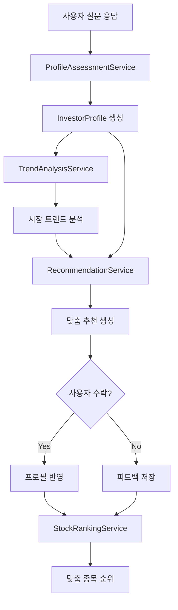

# 투자 성향 분석 및 맞춤 추천 시스템

## 개요

사용자의 투자 성향을 파악하고, 최신 시장 트렌드에 맞는 맞춤형 종목 추천을 제공하는 시스템입니다.

---

## 핵심 기능

### 1. 투자 성향 진단 (Assessment)
- **설문 기반 진단**: 리커트 척도 + 시나리오 기반 질문
- **행동 데이터 분석**: 과거 투자 패턴 분석 (있는 경우)
- **성향 유형 분류**: 5가지 유형 (안정형, 안정추구형, 균형형, 성장추구형, 공격투자형)

### 2. 트렌드 기반 제안 (Recommendation)
- **시장 현황 분석**: 섹터별 트렌드, 모멘텀 분석
- **성향 vs 트렌드 매칭**: 사용자 성향에 맞는 투자 전략 제안
- **제안 수락/거절**: 사용자 피드백 반영

### 3. 맞춤 종목 순위 (Ranking)
- **다중 요소 스코어링**: 성향, 트렌드, AI 예측 결합
- **순위 리스트**: Top 10 종목 + 상세 분석
- **지속적 업데이트**: 시장 변화에 따른 동적 조정

---

## 클린 아키텍처 설계

### Domain Layer (핵심 비즈니스 로직)

```
src/domain/investment_profile/
├── entities/
│   ├── investor_profile.py      # 투자자 프로필 엔티티
│   ├── risk_tolerance.py        # 위험 감수 수준
│   └── investment_style.py      # 투자 스타일 (가치/성장/모멘텀)
├── value_objects/
│   ├── profile_score.py         # 성향 점수 (0-100)
│   └── recommendation.py        # 추천 결과 VO
└── services/
    ├── profile_calculator.py    # 성향 계산 로직
    └── matching_algorithm.py    # 성향-종목 매칭 알고리즘
```

**핵심 엔티티**:
```python
@dataclass
class InvestorProfile:
    user_id: str
    risk_tolerance: RiskTolerance  # 1-5 (보수-공격)
    investment_horizon: str        # short/medium/long
    preferred_sectors: List[str]
    style_scores: Dict[str, float] # value/growth/momentum
    created_at: datetime
    last_updated: datetime
```

---

### Application Layer (서비스)

```
src/services/
├── profile_assessment_service.py   # 설문 처리 및 성향 분석
├── trend_analysis_service.py       # 시장 트렌드 분석
├── recommendation_service.py       # 맞춤 추천 생성
└── stock_ranking_service.py        # 종목 순위 산출
```

**주요 서비스 인터페이스**:
```python
class ProfileAssessmentService:
    def get_assessment_questions() -> List[Question]
    def submit_answers(answers: Dict) -> InvestorProfile
    def update_profile(profile: InvestorProfile, feedback: Feedback) -> InvestorProfile

class RecommendationService:
    def generate_recommendations(profile: InvestorProfile) -> List[Recommendation]
    def accept_recommendation(rec_id: str) -> None
    def reject_recommendation(rec_id: str, reason: str) -> None

class StockRankingService:
    def get_personalized_ranking(profile: InvestorProfile, top_n: int = 10) -> List[RankedStock]
```

---

### Infrastructure Layer (외부 연동)

```
src/infrastructure/
├── repositories/
│   ├── profile_repository.py       # 프로필 저장/조회
│   └── recommendation_repository.py
└── external/
    ├── market_data_adapter.py      # 시장 데이터 연동
    └── ai_prediction_adapter.py    # 기존 AI 모델 연동
```

---

### Presentation Layer (UI)

```
src/dashboard/views/
├── profile_assessment_view.py      # 성향 진단 UI
├── recommendation_view.py          # 추천 수락/거절 UI
└── ranking_view.py                 # 종목 순위 UI
```

---

## 설문 설계

### 질문 유형

| 카테고리 | 질문 예시 | 측정 요소 |
|---------|----------|----------|
| 위험 감수 | "투자금의 30%가 손실되면 어떻게 하시겠습니까?" | risk_tolerance |
| 투자 기간 | "투자 자금은 언제 필요하십니까?" | investment_horizon |
| 목표 수익 | "연 목표 수익률은 얼마입니까?" | expected_return |
| 변동성 허용 | "주가가 하루 5% 하락해도 보유하시겠습니까?" | volatility_tolerance |
| 섹터 선호 | "관심 있는 산업 분야를 선택해주세요" | preferred_sectors |

### 성향 분류 알고리즘

```python
def calculate_profile_type(scores: Dict[str, float]) -> str:
    risk_score = scores['risk_tolerance']
    
    if risk_score <= 20:
        return "안정형"
    elif risk_score <= 40:
        return "안정추구형"
    elif risk_score <= 60:
        return "균형형"
    elif risk_score <= 80:
        return "성장추구형"
    else:
        return "공격투자형"
```

---

## 종목 순위 산출 로직

### 다중 요소 스코어링

```python
def calculate_stock_score(stock, profile, market_trend, ai_prediction):
    # 1. 성향 적합도 (40%)
    profile_fit = calculate_profile_fit(stock, profile)
    
    # 2. 트렌드 점수 (30%)
    trend_score = calculate_trend_alignment(stock, market_trend)
    
    # 3. AI 예측 점수 (30%)
    ai_score = normalize_prediction(ai_prediction)
    
    return (profile_fit * 0.4) + (trend_score * 0.3) + (ai_score * 0.3)
```

### 성향별 가중치 조정

| 성향 유형 | 안정성 가중치 | 성장성 가중치 | 모멘텀 가중치 |
|----------|-------------|-------------|-------------|
| 안정형 | 60% | 25% | 15% |
| 균형형 | 35% | 35% | 30% |
| 공격투자형 | 15% | 40% | 45% |

---

## 데이터 흐름



---

## 기존 시스템 통합

### 연동 모듈

| 기존 모듈 | 활용 방식 |
|----------|----------|
| `EnsemblePredictor` | AI 예측 점수 제공 |
| `RegimeAwarePredictor` | 시장 국면 분석 |
| `TechnicalAnalyzer` | 트렌드 지표 계산 |
| `SentimentAnalysisService` | 뉴스 감성 반영 |
| `StockDataCollector` | 종목 데이터 수집 |

---

## 구현 단계

### Phase 1: Domain 구축 (2일)
- [ ] InvestorProfile 엔티티 구현
- [ ] 성향 계산 알고리즘 구현
- [ ] 단위 테스트 작성

### Phase 2: 설문 시스템 (2일)
- [ ] 설문 질문 DB 설계
- [ ] ProfileAssessmentService 구현
- [ ] 설문 UI 구현

### Phase 3: 추천 시스템 (3일)
- [ ] TrendAnalysisService 구현
- [ ] RecommendationService 구현
- [ ] 수락/거절 피드백 처리

### Phase 4: 종목 순위 (2일)
- [ ] StockRankingService 구현
- [ ] 기존 AI 모델 연동
- [ ] 순위 UI 구현

### Phase 5: 통합 테스트 (1일)
- [ ] E2E 테스트
- [ ] 사용자 피드백 반영

---

## 검증 계획

### 자동화 테스트
```bash
# 단위 테스트
pytest tests/domain/test_investor_profile.py -v

# 서비스 테스트
pytest tests/services/test_profile_assessment.py -v
pytest tests/services/test_stock_ranking.py -v
```

### 수동 검증
1. 설문 완료 → 성향 유형 확인
2. 트렌드 제안 수락/거절 → 프로필 반영 확인
3. 종목 순위 → 성향과의 일치도 확인

---

## 예상 UI

### 성향 진단 화면
```
📊 투자 성향 진단
━━━━━━━━━━━━━━━━━━━━━

Q1. 투자금 일부가 손실되면 어떻게 하시겠습니까?
○ 즉시 모두 매도
○ 일부 매도
○ 유지
○ 추가 매수

[◉━━━━━━━━━━━━ 5/15]    [다음 →]
```

### 종목 순위 화면
```
🏆 나의 맞춤 종목 Top 10
━━━━━━━━━━━━━━━━━━━━━

성향: 균형형 | 업데이트: 2025-12-25

순위  종목명        적합도   AI예측
━━━━━━━━━━━━━━━━━━━━━━━━━━━━━━━━
1     삼성전자      92%     📈 상승
2     SK하이닉스    88%     📈 상승
3     NAVER        85%     📊 보합
...
```

---

## 결론

이 시스템은 사용자의 투자 성향을 정확히 파악하고, 시장 트렌드와 AI 분석을 결합하여 **개인화된 종목 추천**을 제공합니다. 클린 아키텍처를 따라 확장성과 유지보수성을 확보합니다.

---
---

# 📋 기획서 검토 및 수정사항

> **검토일**: 2025-12-25
> **검토 기준**: Feature Planner Skill + Clean Architecture Compliance
> **검토자**: Claude Code (Sonnet 4.5)

---

## ✅ 강점 분석

### 1. Clean Architecture 레이어 구조 ⭐⭐⭐⭐⭐

**평가**:
- ✅ Domain/Application/Infrastructure/Presentation 명확히 분리
- ✅ Repository Pattern 적용 (profile_repository, recommendation_repository)
- ✅ Service Layer DI 설계 (ProfileAssessmentService, RecommendationService)
- ✅ Rich Domain Model (InvestorProfile 엔티티에 style_scores 등 비즈니스 로직 포함)

**기대 효과**:
- 테스트 가능성 향상 (Mock Repository 주입 가능)
- 향후 SQLite → PostgreSQL 마이그레이션 용이
- UI 변경 시 비즈니스 로직 영향 없음

---

### 2. 다중 요소 스코어링 알고리즘 ⭐⭐⭐⭐

**평가**:
```python
score = (profile_fit * 0.4) + (trend_score * 0.3) + (ai_score * 0.3)
```
- ✅ 사용자 성향(40%)을 가장 높은 비중으로 설정 (합리적)
- ✅ 트렌드(30%)와 AI 예측(30%) 균형
- ✅ 성향별 가중치 조정 테이블 제공 (안정형 vs 공격투자형)

**개선 가능성**:
- 가중치를 사용자가 조정 가능하도록 하면 더 유연함 (Phase 6 고려)

---

### 3. 설문 설계 방향 ⭐⭐⭐⭐

**평가**:
- ✅ 5가지 측정 요소 (위험 감수, 투자 기간, 목표 수익, 변동성 허용, 섹터 선호)
- ✅ 리커트 척도 + 시나리오 기반 질문 혼합
- ✅ 행동 데이터 분석 고려 (과거 투자 패턴)

---

### 4. 기존 시스템 통합 계획 ⭐⭐⭐⭐⭐

**평가**:
- ✅ EnsemblePredictor, RegimeAwarePredictor 등 기존 모듈 활용
- ✅ Phase 9-13 연속성 유지 (Strangler Fig Pattern)

---

## 🔴 중대한 누락 사항

### 1. 데이터 영속성 전략 미정의 (우선순위: ⭐⭐⭐⭐⭐)

**문제**:
- ✅ Repository Interface는 정의됨 (`profile_repository.py`)
- ❌ **구체적인 저장 방식 미정의** (JSON? SQLite? Session State?)
- ❌ 다중 사용자 환경에서 프로필 격리 방법 불명확

**영향**:
- Streamlit Session State만 사용 시 → 브라우저 닫으면 프로필 손실
- JSON 파일 사용 시 → 동시 접근 문제
- 멀티 유저 환경 고려 안 되면 프로덕션 배포 불가

**해결 방안**:

#### Option A: SQLite (권장)
```python
# src/infrastructure/repositories/profile_repository.py
from src.domain.repositories.interfaces import IProfileRepository
from src.domain.entities.investor_profile import InvestorProfile
import sqlite3
from typing import Optional

class SQLiteProfileRepository(IProfileRepository):
    def __init__(self, db_path: str = "data/profiles.db"):
        self.db_path = db_path
        self._init_db()

    def _init_db(self):
        conn = sqlite3.connect(self.db_path)
        cursor = conn.cursor()
        cursor.execute("""
            CREATE TABLE IF NOT EXISTS investor_profiles (
                user_id TEXT PRIMARY KEY,
                risk_tolerance INTEGER,
                investment_horizon TEXT,
                preferred_sectors TEXT,  -- JSON string
                style_scores TEXT,       -- JSON string
                created_at TEXT,
                last_updated TEXT
            )
        """)
        conn.commit()
        conn.close()

    def save(self, profile: InvestorProfile) -> bool:
        import json
        conn = sqlite3.connect(self.db_path)
        cursor = conn.cursor()

        cursor.execute("""
            INSERT OR REPLACE INTO investor_profiles
            VALUES (?, ?, ?, ?, ?, ?, ?)
        """, (
            profile.user_id,
            profile.risk_tolerance.value,
            profile.investment_horizon,
            json.dumps(profile.preferred_sectors),
            json.dumps(profile.style_scores),
            profile.created_at.isoformat(),
            profile.last_updated.isoformat()
        ))

        conn.commit()
        conn.close()
        return True

    def load(self, user_id: str) -> Optional[InvestorProfile]:
        import json
        from datetime import datetime

        conn = sqlite3.connect(self.db_path)
        cursor = conn.cursor()
        cursor.execute(
            "SELECT * FROM investor_profiles WHERE user_id = ?",
            (user_id,)
        )
        row = cursor.fetchone()
        conn.close()

        if not row:
            return None

        return InvestorProfile(
            user_id=row[0],
            risk_tolerance=RiskTolerance(row[1]),
            investment_horizon=row[2],
            preferred_sectors=json.loads(row[3]),
            style_scores=json.loads(row[4]),
            created_at=datetime.fromisoformat(row[5]),
            last_updated=datetime.fromisoformat(row[6])
        )
```

#### Option B: Hybrid (Session + JSON Backup)
```python
# src/infrastructure/repositories/session_profile_repository.py
class SessionProfileRepository(IProfileRepository):
    """Streamlit Session State + JSON Backup"""

    def __init__(self, backup_dir: str = "data/profiles"):
        self.backup_dir = Path(backup_dir)
        self.backup_dir.mkdir(parents=True, exist_ok=True)

    def save(self, profile: InvestorProfile) -> bool:
        import streamlit as st

        # Session State에 저장 (빠른 접근)
        st.session_state[f"profile_{profile.user_id}"] = profile

        # JSON Backup (영구 저장)
        backup_path = self.backup_dir / f"{profile.user_id}.json"
        with open(backup_path, 'w') as f:
            json.dump(profile.to_dict(), f, indent=2)

        return True

    def load(self, user_id: str) -> Optional[InvestorProfile]:
        import streamlit as st

        # Session State 우선 조회
        if f"profile_{user_id}" in st.session_state:
            return st.session_state[f"profile_{user_id}"]

        # JSON Backup에서 복원
        backup_path = self.backup_dir / f"{user_id}.json"
        if backup_path.exists():
            with open(backup_path, 'r') as f:
                data = json.load(f)
            profile = InvestorProfile.from_dict(data)
            st.session_state[f"profile_{user_id}"] = profile
            return profile

        return None
```

**추가 필요 작업**:
- Phase 1에 "데이터 저장소 설계 (SQLite/JSON 선택)" 추가
- `InvestorProfile.to_dict()` / `from_dict()` 메서드 구현

---

### 2. 설문 데이터 모델 미정의 (우선순위: ⭐⭐⭐⭐⭐)

**문제**:
- ✅ 설문 질문 예시는 제시됨
- ❌ **Question 엔티티 정의 없음**
- ❌ 설문 문항 저장 방식 불명확 (하드코딩? DB? YAML?)

**해결 방안**:

#### Domain Layer: Question Entity
```python
# src/domain/entities/assessment.py
from dataclasses import dataclass
from typing import List, Dict
from enum import Enum

class QuestionType(Enum):
    LIKERT_SCALE = "likert"      # 1-5 척도
    SCENARIO = "scenario"         # 시나리오 선택
    MULTI_SELECT = "multi_select" # 복수 선택 (섹터 등)

@dataclass
class Question:
    question_id: str
    category: str  # risk_tolerance, investment_horizon, etc.
    question_text: str
    question_type: QuestionType
    options: List[Dict[str, any]]  # [{"label": "즉시 매도", "score": 0}, ...]
    weight: float = 1.0  # 질문 가중치 (일부 질문이 더 중요할 수 있음)

@dataclass
class Answer:
    question_id: str
    selected_option: str
    score: float
    answered_at: datetime
```

#### Infrastructure Layer: Question Repository
```python
# src/infrastructure/repositories/question_repository.py
class YAMLQuestionRepository:
    """YAML 파일에서 설문 문항 로드"""

    def __init__(self, yaml_path: str = "config/assessment_questions.yaml"):
        self.yaml_path = yaml_path

    def load_questions(self) -> List[Question]:
        import yaml

        with open(self.yaml_path, 'r', encoding='utf-8') as f:
            data = yaml.safe_load(f)

        questions = []
        for q_data in data['questions']:
            questions.append(Question(
                question_id=q_data['id'],
                category=q_data['category'],
                question_text=q_data['text'],
                question_type=QuestionType(q_data['type']),
                options=q_data['options'],
                weight=q_data.get('weight', 1.0)
            ))

        return questions
```

#### 설문 데이터 예시 (config/assessment_questions.yaml)
```yaml
questions:
  - id: Q001
    category: risk_tolerance
    text: "투자금의 30%가 손실되면 어떻게 하시겠습니까?"
    type: scenario
    weight: 1.5  # 중요한 질문
    options:
      - label: "즉시 모두 매도"
        score: 0
      - label: "일부 매도 후 관망"
        score: 25
      - label: "보유 유지"
        score: 50
      - label: "추가 매수 기회로 본다"
        score: 100

  - id: Q002
    category: investment_horizon
    text: "투자 자금은 언제 필요하십니까?"
    type: likert
    weight: 1.0
    options:
      - label: "1년 이내"
        score: 20
      - label: "1-3년"
        score: 40
      - label: "3-5년"
        score: 60
      - label: "5-10년"
        score: 80
      - label: "10년 이상"
        score: 100

  - id: Q003
    category: preferred_sectors
    text: "관심 있는 산업 분야를 선택해주세요 (복수 선택)"
    type: multi_select
    weight: 0.8
    options:
      - label: "기술/IT"
        value: "Technology"
      - label: "헬스케어"
        value: "Healthcare"
      - label: "금융"
        value: "Financials"
      - label: "에너지"
        value: "Energy"
      - label: "소비재"
        value: "Consumer"
```

**추가 필요 작업**:
- Phase 1에 "설문 문항 YAML 작성" 추가
- Question 엔티티 단위 테스트

---

### 3. 추천 수락/거절 피드백 루프 구현 미흡 (우선순위: ⭐⭐⭐⭐)

**문제**:
- ✅ `RecommendationService.accept_recommendation()` / `reject_recommendation()` 인터페이스 정의됨
- ❌ **피드백이 프로필에 어떻게 반영되는지 로직 없음**
- ❌ 거절 사유(reason) 분석 방법 미정의

**해결 방안**:

#### Feedback 기반 프로필 업데이트 로직
```python
# src/services/profile_assessment_service.py
class ProfileAssessmentService:
    def update_profile_from_feedback(
        self,
        profile: InvestorProfile,
        feedback: RecommendationFeedback
    ) -> InvestorProfile:
        """
        추천 수락/거절 피드백을 반영하여 프로필 조정

        예: 사용자가 "공격투자형" 프로필이지만
            "변동성 높음" 이유로 종목을 계속 거절
            → risk_tolerance를 점진적으로 낮춤
        """
        if feedback.action == "reject":
            # 거절 사유 분석
            if "변동성" in feedback.reason or "위험" in feedback.reason:
                # 위험 감수 점수 -5점 조정 (점진적 학습)
                new_risk = max(0, profile.risk_tolerance.value - 5)
                profile.risk_tolerance = RiskTolerance(new_risk)

            elif "섹터" in feedback.reason:
                # 추천된 섹터를 preferred_sectors에서 제거
                rejected_sector = feedback.recommendation.sector
                if rejected_sector in profile.preferred_sectors:
                    profile.preferred_sectors.remove(rejected_sector)

        elif feedback.action == "accept":
            # 수락한 종목의 특성 강화
            rec = feedback.recommendation

            # 해당 섹터 선호도 증가
            if rec.sector not in profile.preferred_sectors:
                profile.preferred_sectors.append(rec.sector)

            # 투자 스타일 점수 조정
            if rec.style == "growth":
                profile.style_scores["growth"] = min(100, profile.style_scores["growth"] + 5)
            elif rec.style == "value":
                profile.style_scores["value"] = min(100, profile.style_scores["value"] + 5)

        profile.last_updated = datetime.now()
        return profile
```

#### Feedback 엔티티 정의
```python
# src/domain/entities/recommendation.py
from dataclasses import dataclass
from datetime import datetime

@dataclass
class RecommendationFeedback:
    recommendation_id: str
    user_id: str
    action: str  # "accept" or "reject"
    reason: str  # 거절 사유 (자유 텍스트 or 선택지)
    created_at: datetime

    # 추천 컨텍스트 (분석용)
    recommendation: "Recommendation"  # 어떤 추천이었는지
```

#### UI에서 피드백 수집
```python
# src/dashboard/views/recommendation_view.py
def display_recommendation(rec: Recommendation):
    st.subheader(f"📈 {rec.stock_name} ({rec.ticker})")
    st.write(f"적합도: {rec.fit_score}% | AI 예측: {rec.ai_prediction}")

    col1, col2 = st.columns(2)

    with col1:
        if st.button("✅ 수락", key=f"accept_{rec.id}"):
            feedback = RecommendationFeedback(
                recommendation_id=rec.id,
                user_id=st.session_state.user_id,
                action="accept",
                reason="",
                created_at=datetime.now(),
                recommendation=rec
            )
            service.process_feedback(feedback)
            st.success("프로필에 반영되었습니다!")

    with col2:
        if st.button("❌ 거절", key=f"reject_{rec.id}"):
            reason = st.text_input("거절 사유 (선택)", key=f"reason_{rec.id}")
            feedback = RecommendationFeedback(
                recommendation_id=rec.id,
                user_id=st.session_state.user_id,
                action="reject",
                reason=reason,
                created_at=datetime.now(),
                recommendation=rec
            )
            service.process_feedback(feedback)
            st.info("피드백이 반영되었습니다.")
```

---

### 4. 실시간 vs 배치 순위 업데이트 전략 미정의 (우선순위: ⭐⭐⭐⭐)

**문제**:
- 문서: "지속적 업데이트: 시장 변화에 따른 동적 조정"
- ❌ **실시간 업데이트 vs 일 1회 배치 vs 사용자 요청 시 업데이트 불명확**

**영향**:
- 실시간: API 호출 비용 폭증, 서버 부하
- 배치(일 1회): 장중 급등/급락 종목 놓침
- 사용자 요청 시: 첫 조회 시 대기 시간 길어짐

**해결 방안**:

#### Hybrid 전략 (권장)
```python
# src/services/stock_ranking_service.py
class StockRankingService:
    def __init__(
        self,
        profile_repo: IProfileRepository,
        stock_repo: IStockRepository,
        cache_ttl: int = 3600  # 1시간 캐시
    ):
        self.profile_repo = profile_repo
        self.stock_repo = stock_repo
        self.cache = {}
        self.cache_ttl = cache_ttl

    def get_personalized_ranking(
        self,
        user_id: str,
        top_n: int = 10,
        force_refresh: bool = False
    ) -> List[RankedStock]:
        """
        순위 조회 전략:
        1. 캐시 확인 (1시간 이내 데이터 있으면 반환)
        2. 캐시 없으면 실시간 계산 후 캐시 저장
        3. force_refresh=True면 무조건 재계산
        """
        cache_key = f"ranking_{user_id}"

        # 캐시 확인
        if not force_refresh and cache_key in self.cache:
            cached_data, cached_time = self.cache[cache_key]
            if (datetime.now() - cached_time).seconds < self.cache_ttl:
                return cached_data

        # 실시간 계산
        profile = self.profile_repo.load(user_id)
        ranking = self._calculate_ranking(profile, top_n)

        # 캐시 저장
        self.cache[cache_key] = (ranking, datetime.now())

        return ranking
```

#### 백그라운드 배치 업데이트 (선택 사항)
```python
# scripts/update_rankings_batch.py
"""
매일 장 마감 후(오후 5시) 모든 사용자 순위 미리 계산
→ 다음 날 사용자 접속 시 즉시 표시
"""
import schedule
import time

def update_all_rankings():
    service = StockRankingService(...)

    # 모든 사용자 프로필 조회
    all_users = profile_repo.list_all_users()

    for user_id in all_users:
        print(f"Updating {user_id}...")
        service.get_personalized_ranking(user_id, force_refresh=True)

# 매일 오후 5시 실행
schedule.every().day.at("17:00").do(update_all_rankings)

while True:
    schedule.run_pending()
    time.sleep(60)
```

**권장 사항**:
- **Phase 1 (MVP)**: 사용자 요청 시 + 1시간 캐시
- **Phase 6 (향상)**: 장 마감 후 배치 업데이트 추가

---

### 5. Cold Start 문제 미대응 (우선순위: ⭐⭐⭐)

**문제**:
- 신규 사용자: 설문만으로 프로필 생성 (OK)
- ❌ **설문 미응답 사용자 처리 방법 없음**
- ❌ 데이터 부족 시 기본 프로필 정의 안 됨

**해결 방안**:

#### 기본 프로필 제공
```python
# src/domain/entities/investor_profile.py
@dataclass
class InvestorProfile:
    # ...

    @classmethod
    def create_default(cls, user_id: str) -> "InvestorProfile":
        """
        설문 미응답 사용자용 기본 프로필
        → "균형형" (중간 위험 감수)
        """
        return cls(
            user_id=user_id,
            risk_tolerance=RiskTolerance(50),  # 균형형
            investment_horizon="medium",
            preferred_sectors=["Technology", "Healthcare", "Financials"],  # 인기 섹터
            style_scores={"value": 33.3, "growth": 33.3, "momentum": 33.4},
            created_at=datetime.now(),
            last_updated=datetime.now()
        )
```

#### UI에서 기본 프로필 제안
```python
# src/dashboard/views/profile_assessment_view.py
def show_assessment():
    user_id = st.session_state.get("user_id", "guest")
    profile = profile_repo.load(user_id)

    if profile is None:
        st.warning("💡 투자 성향 진단을 완료하지 않으셨습니다.")

        col1, col2 = st.columns(2)

        with col1:
            if st.button("📝 성향 진단 시작 (추천)"):
                st.session_state.page = "assessment"

        with col2:
            if st.button("⚡ 기본 프로필로 시작"):
                default_profile = InvestorProfile.create_default(user_id)
                profile_repo.save(default_profile)
                st.info("균형형 프로필이 적용되었습니다. 언제든 설문을 통해 수정 가능합니다.")
```

---

### 6. 프로필 드리프트 감지 없음 (우선순위: ⭐⭐⭐)

**문제**:
- 사용자의 투자 성향은 시간에 따라 변할 수 있음
  - 예: 은퇴가 가까워지면 보수적으로 변함
  - 예: 수익 경험 후 공격적으로 변함
- ❌ **프로필 재진단 권장 로직 없음**

**해결 방안**:

#### 프로필 유효 기간 설정
```python
# src/services/profile_assessment_service.py
def is_profile_outdated(profile: InvestorProfile, threshold_days: int = 180) -> bool:
    """프로필이 6개월 이상 된 경우 재진단 권장"""
    days_since_update = (datetime.now() - profile.last_updated).days
    return days_since_update > threshold_days
```

#### UI에서 재진단 알림
```python
# src/dashboard/app.py
profile = profile_repo.load(user_id)

if profile and profile_service.is_profile_outdated(profile):
    st.info("""
    ⏰ **성향 재진단 권장**

    마지막 진단 후 6개월이 지났습니다.
    투자 목표나 상황이 변경되었을 수 있습니다.
    """)

    if st.button("🔄 재진단 시작"):
        st.session_state.page = "assessment"
```

---

## 🟡 개선 권장 사항

### 7. 성향-종목 매칭 알고리즘 세부화 필요 (우선순위: ⭐⭐⭐)

**현재 문서**:
```python
profile_fit = calculate_profile_fit(stock, profile)  # 구체적 로직 없음
```

**개선안**:
```python
# src/domain/services/matching_algorithm.py
def calculate_profile_fit(stock: StockEntity, profile: InvestorProfile) -> float:
    """
    성향 적합도 계산 (0-100점)

    고려 요소:
    1. 변동성 vs 위험 감수 수준 (40%)
    2. 섹터 선호도 (30%)
    3. 투자 스타일 매칭 (30%)
    """
    # 1. 변동성 적합도 (40%)
    stock_volatility = stock.calculate_volatility(period=90)  # 3개월 변동성

    if profile.risk_tolerance.value <= 20:  # 안정형
        ideal_vol_range = (0.0, 0.15)
    elif profile.risk_tolerance.value <= 40:  # 안정추구형
        ideal_vol_range = (0.10, 0.25)
    elif profile.risk_tolerance.value <= 60:  # 균형형
        ideal_vol_range = (0.20, 0.35)
    elif profile.risk_tolerance.value <= 80:  # 성장추구형
        ideal_vol_range = (0.30, 0.50)
    else:  # 공격투자형
        ideal_vol_range = (0.40, 1.00)

    vol_fit = 100 if ideal_vol_range[0] <= stock_volatility <= ideal_vol_range[1] else \
              max(0, 100 - abs(stock_volatility - np.mean(ideal_vol_range)) * 200)

    # 2. 섹터 적합도 (30%)
    sector_fit = 100 if stock.sector in profile.preferred_sectors else 30

    # 3. 투자 스타일 적합도 (30%)
    # stock.style_scores = {"value": 70, "growth": 20, "momentum": 10}
    style_similarity = sum(
        profile.style_scores[style] * stock.style_scores[style] / 100
        for style in ["value", "growth", "momentum"]
    )

    # 가중 합계
    total_fit = (vol_fit * 0.4) + (sector_fit * 0.3) + (style_similarity * 0.3)

    return total_fit
```

---

### 8. 기존 Phase 9-13 통합 검증 필요 (우선순위: ⭐⭐⭐⭐)

**문제**:
- 문서에 EnsemblePredictor, RegimeAwarePredictor 등 언급
- ❌ **실제 연동 코드 예시 없음**

**해결 방안**:

#### EnsemblePredictor 연동
```python
# src/services/stock_ranking_service.py
class StockRankingService:
    def __init__(
        self,
        profile_repo: IProfileRepository,
        stock_repo: IStockRepository,
        ai_predictor: EnsemblePredictor  # Phase 9 AI 모델
    ):
        self.profile_repo = profile_repo
        self.stock_repo = stock_repo
        self.ai_predictor = ai_predictor

    def _calculate_ranking(self, profile: InvestorProfile, top_n: int):
        # 1. 후보 종목 수집
        candidates = self.stock_repo.get_all_tickers()

        ranked = []
        for ticker in candidates:
            stock = self.stock_repo.get_stock(ticker, period="3mo")

            # 2. 성향 적합도 (40%)
            profile_fit = calculate_profile_fit(stock, profile)

            # 3. 트렌드 점수 (30%)
            # Phase 9: TechnicalAnalyzer 활용
            from src.analyzers.technical_analyzer import TechnicalAnalyzer
            tech_analyzer = TechnicalAnalyzer()
            trend_score = tech_analyzer.calculate_momentum_score(stock.df)

            # 4. AI 예측 점수 (30%)
            # Phase 9: EnsemblePredictor 활용
            ai_prediction = self.ai_predictor.predict(ticker, stock.df)
            ai_score = normalize_prediction(ai_prediction)  # 0-100 정규화

            # 최종 점수
            composite_score = (profile_fit * 0.4) + (trend_score * 0.3) + (ai_score * 0.3)

            ranked.append(RankedStock(
                ticker=ticker,
                score=composite_score,
                profile_fit=profile_fit,
                trend_score=trend_score,
                ai_score=ai_score
            ))

        # 상위 N개 반환
        ranked.sort(key=lambda x: x.score, reverse=True)
        return ranked[:top_n]
```

#### 통합 테스트 추가
```python
# tests/test_investment_profile_integration.py
def test_ranking_with_ensemble_predictor():
    """Phase 9 EnsemblePredictor + 투자 성향 통합 테스트"""
    from src.models.ensemble_predictor import EnsemblePredictor

    # Phase 9 모델 로드
    predictor = EnsemblePredictor()
    predictor.load_models("AAPL")

    # 투자 성향 서비스
    ranking_service = StockRankingService(
        profile_repo=MockProfileRepository(),
        stock_repo=YFinanceStockRepository(),
        ai_predictor=predictor
    )

    # 공격투자형 프로필
    aggressive_profile = InvestorProfile(
        user_id="test",
        risk_tolerance=RiskTolerance(90),
        investment_horizon="long",
        preferred_sectors=["Technology"],
        style_scores={"value": 20, "growth": 50, "momentum": 30}
    )

    # 순위 계산
    ranking = ranking_service._calculate_ranking(aggressive_profile, top_n=5)

    # 검증: 변동성 높은 종목이 상위에 있어야 함
    assert ranking[0].ticker in ["TSLA", "NVDA", "AMD"]
```

---

### 9. UI/UX 접근성 개선 (우선순위: ⭐⭐)

**현재 문서**:
- 텍스트 기반 UI 예시만 제공

**개선안**:

#### 설문 진행률 시각화
```python
# src/dashboard/views/profile_assessment_view.py
def show_progress_bar(current_question: int, total_questions: int):
    progress = current_question / total_questions
    st.progress(progress)
    st.caption(f"질문 {current_question}/{total_questions}")
```

#### 순위 시각화
```python
def display_ranking_chart(ranking: List[RankedStock]):
    import plotly.graph_objects as go

    tickers = [r.ticker for r in ranking]
    scores = [r.score for r in ranking]

    fig = go.Figure(data=[
        go.Bar(
            x=tickers,
            y=scores,
            marker_color='lightblue',
            text=[f"{s:.1f}" for s in scores],
            textposition='auto'
        )
    ])

    fig.update_layout(
        title="🏆 나의 맞춤 종목 순위",
        xaxis_title="종목",
        yaxis_title="적합도 점수",
        yaxis_range=[0, 100]
    )

    st.plotly_chart(fig)
```

---

## 📊 수정된 구현 일정

### 원래 일정: 10일
### 수정 일정: **14-15일** (+40%)

| Phase | 작업 내용 | 원래 | 수정 | 변경 사유 |
|-------|----------|------|------|----------|
| **Phase 1** | Domain 구축 + **데이터 저장소 설계** | 2일 | **3일** | SQLite/JSON 선택, 마이그레이션 전략 |
| **Phase 2** | 설문 시스템 + **Question Repository** | 2일 | **3일** | YAML 설문 설계, 다국어 지원 고려 |
| **Phase 3** | 추천 시스템 + **피드백 루프** | 3일 | **4일** | 피드백 → 프로필 업데이트 로직 추가 |
| **Phase 4** | 종목 순위 + **캐싱 전략** | 2일 | **2일** | - |
| **Phase 5** | 통합 테스트 + **Phase 9 연동 검증** | 1일 | **2일** | EnsemblePredictor 통합 테스트 |
| **Phase 6 (New)** | **프로필 드리프트 감지** | - | **+1일** | 재진단 권장 로직 |

**총 소요 기간**: 14-15일

---

## 🧪 강화된 테스트 전략

### Level 1: 단위 테스트
```python
# tests/domain/test_investor_profile.py
def test_profile_creation():
    profile = InvestorProfile.create_default("user123")
    assert profile.risk_tolerance.value == 50

def test_profile_update_from_reject_feedback():
    profile = InvestorProfile(
        user_id="test",
        risk_tolerance=RiskTolerance(80),  # 성장추구형
        ...
    )

    feedback = RecommendationFeedback(
        recommendation_id="rec001",
        user_id="test",
        action="reject",
        reason="변동성이 너무 높음",
        ...
    )

    service = ProfileAssessmentService(...)
    updated = service.update_profile_from_feedback(profile, feedback)

    # 위험 감수 점수 감소 확인
    assert updated.risk_tolerance.value == 75
```

### Level 2: 통합 테스트
```python
# tests/integration/test_profile_to_ranking.py
def test_conservative_profile_gets_stable_stocks():
    """안정형 프로필 → 변동성 낮은 종목 추천 확인"""

    conservative_profile = InvestorProfile(
        user_id="test",
        risk_tolerance=RiskTolerance(20),  # 안정형
        preferred_sectors=["Utilities", "Consumer Staples"]
    )

    ranking_service = StockRankingService(...)
    top_stocks = ranking_service.get_personalized_ranking("test", top_n=5)

    # 상위 종목의 평균 변동성이 낮아야 함
    avg_volatility = np.mean([s.volatility for s in top_stocks])
    assert avg_volatility < 0.20  # 20% 이하
```

### Level 3: E2E 테스트
```python
# tests/e2e/test_full_workflow.py
def test_new_user_journey():
    """신규 사용자 전체 플로우"""

    # 1. 설문 응답
    answers = {
        "Q001": {"score": 50},  # 중간 위험 감수
        "Q002": {"score": 60},  # 3-5년 투자
        ...
    }

    profile = assessment_service.submit_answers("user123", answers)
    assert profile.risk_tolerance.value == 55  # 균형형

    # 2. 추천 생성
    recommendations = recommendation_service.generate_recommendations(profile)
    assert len(recommendations) > 0

    # 3. 추천 거절
    feedback = RecommendationFeedback(
        recommendation_id=recommendations[0].id,
        action="reject",
        reason="섹터 선호 안 함"
    )
    updated_profile = assessment_service.update_profile_from_feedback(profile, feedback)

    # 4. 순위 조회
    ranking = ranking_service.get_personalized_ranking("user123", top_n=10)
    assert len(ranking) == 10
```

---

## 🚀 프로덕션 체크리스트

### 배포 전 필수 확인 사항

- [ ] **데이터 영속성**
  - [ ] SQLite DB 백업 전략 수립
  - [ ] 멀티 유저 동시 접근 테스트

- [ ] **성능**
  - [ ] 순위 계산 시간 < 3초 (100개 종목 기준)
  - [ ] 캐시 히트율 > 80%

- [ ] **보안**
  - [ ] 사용자 ID 검증 (Session Hijacking 방지)
  - [ ] SQL Injection 방어 (Parameterized Query 사용)

- [ ] **모니터링**
  - [ ] 프로필 생성 성공률 추적
  - [ ] 추천 수락률 로깅 (A/B 테스트용)

---

## 📌 최종 권장 사항

### 우선순위 P0 (즉시 해결)
1. ✅ **데이터 저장소 설계** → SQLite 권장
2. ✅ **설문 Question 엔티티 + YAML 저장**
3. ✅ **피드백 루프 구현** → 프로필 업데이트 로직

### 우선순위 P1 (Phase 3 전까지)
4. ✅ **캐싱 전략 설계** → 1시간 TTL
5. ✅ **Phase 9 EnsemblePredictor 연동 검증**

### 우선순위 P2 (Phase 5 이후)
6. ✅ **프로필 드리프트 감지** → 6개월 재진단 권장
7. ✅ **UI/UX 시각화** → Plotly 차트 추가

---

## 🎯 결론

**강점**:
- ✅ Clean Architecture 설계 우수
- ✅ 다중 요소 스코어링 알고리즘 합리적
- ✅ 기존 Phase 9-13 통합 방향 명확

**개선 필요**:
- 🔴 데이터 영속성 전략 추가 (SQLite)
- 🔴 설문 데이터 모델 구체화 (YAML)
- 🔴 피드백 루프 로직 구현
- 🟡 캐싱 및 성능 최적화
- 🟡 프로필 드리프트 감지

**수정 후 예상 효과**:
- 멀티 유저 환경 지원 가능
- 프로필 정확도 점진적 향상 (피드백 루프)
- Phase 9-13과 완벽 통합
- 프로덕션 배포 가능 수준 달성

---

**검토 완료일**: 2025-12-25
**다음 단계**: Phase 1 착수 (Domain Layer + SQLite 설계)
